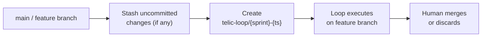

# Telic Loop: Logic Flow

```mermaid
flowchart TD
    %% ============================================================
    %% INPUTS
    %% ============================================================
    Human([Human provides<br/>VISION.md + PRD.md]) --> InputVal

    %% ============================================================
    %% PRE-LOOP
    %% ============================================================
    subgraph PRELOOP["PRE-LOOP — Qualify the work"]
        direction TB

        InputVal{{"R1: Input Validation<br/>Files exist?"}}
        InputVal -- missing --> ErrExit([Exit with error])
        InputVal -- ok --> GitSetup

        GitSetup["GIT: Setup sprint branch<br/>Detect protected branch →<br/>stash changes → create<br/>telic-loop/{sprint}-{ts}"]
        GitSetup --> VisionVal

        subgraph VisionRefine["Vision Refinement Loop (Phase 3)"]
            VisionVal["R8: Vision Validation<br/>5-pass analysis (Opus)"]
            VisionVal --> VisionResult{PASS?}
            VisionResult -- yes --> ComplexClass
            VisionResult -- "issues found" --> ClassifyIssues["Classify HARD / SOFT"]
            ClassifyIssues --> ResearchHard["Research alternatives<br/>for HARD issues (Opus)"]
            ResearchHard --> PresentHuman["Present to human<br/>with recommendations"]
            PresentHuman --> HumanRevises["Human revises VISION.md"]
            HumanRevises --> VisionVal
        end

        ComplexClass{"R28: Complexity<br/>Classification"}
        ComplexClass -- "single_run<br/>(<15 tasks)" --> Discovery
        ComplexClass -- "multi_epic<br/>(complex)" --> EpicDecomp

        EpicDecomp["R29: Epic Decomposition<br/>2-5 value blocks (Opus)"]
        EpicDecomp --> Discovery

        Discovery["R2: Context Discovery (Opus)<br/>Derive deliverable type, tech stack,<br/>services, verification strategy"]

        Discovery --> PRDRefine

        subgraph PRDRefineLoop["PRD Refinement Loop"]
            PRDRefine["R3: PRD Critique (Opus)<br/>Challenge feasibility"]
            PRDRefine --> PRDVerdict{Verdict?}
            PRDVerdict -- APPROVE --> PlanGen
            PRDVerdict -- AMEND --> ApplyAmend["Apply amendments"] --> PlanGen
            PRDVerdict -- DESCOPE --> ApplyDescope["Descope items"] --> PlanGen
            PRDVerdict -- REJECT --> PRDResearch["Research feasible<br/>alternatives (Opus)"]
            PRDResearch --> PRDPresent["Present proposals<br/>to human"]
            PRDPresent --> HumanRevisesPRD["Human revises PRD"]
            HumanRevisesPRD --> PRDRefine
        end

        PlanGen["R4: Plan Generation (Opus)<br/>Tasks via manage_task tool"]

        PlanGen --> QualityGates

        subgraph QGates["Quality Gates (Opus)"]
            QualityGates["R5: CRAAP → CLARITY → VALIDATE<br/>→ CONNECT → BREAK → PRUNE → TIDY"]
        end

        QualityGates --> BlockerRes

        BlockerRes["R6: Blocker Resolution<br/>Resolve or descope ALL blockers"]
        BlockerRes --> Preflight

        Preflight["R7: Preflight Check<br/>Tools, env vars, services"]
        Preflight --> PreflightResult{Pass?}
        PreflightResult -- fail --> PreflightFix["Fix environment<br/>or Interactive Pause"]
        PreflightFix --> Preflight
        PreflightResult -- pass --> InitVRC["Initial VRC baseline"]

        InitVRC --> PreLoopCommit["GIT: Commit + Checkpoint<br/>'Pre-loop complete — plan ready'"]
    end

    %% ============================================================
    %% VALUE LOOP
    %% ============================================================
    PreLoopCommit --> DecisionEngine

    subgraph VALUELOOP["THE VALUE LOOP — Deliver value iteratively"]
        direction TB

        DecisionEngine["Decision Engine<br/>(deterministic, no LLM)<br/>Read state → pick action"]

        DecisionEngine --> Priority

        subgraph Priority["Priority-Ordered Actions"]
            direction TB
            P0{"P0: Paused for<br/>human action?"}
            P0 -- yes --> InteractivePause
            P0 -- no --> P1

            P1{"P1: Services down?<br/>(software only)"}
            P1 -- yes --> ServiceFix
            P1 -- no --> P2

            P2{"P2: Stuck?<br/>(N iters no progress)"}
            P2 -- yes --> CourseCorrect
            P2 -- no --> P3

            P3{"P3: QC needs<br/>generating?"}
            P3 -- yes --> GenerateQC
            P3 -- no --> P4

            P4{"P4: QC checks<br/>failing?"}
            P4 -- yes --> FixFlow
            P4 -- no --> P5

            P5{"P5: Task blocked<br/>on human?"}
            P5 -- yes --> InteractivePause
            P5 -- no --> P6

            P6{"P6: Pending<br/>tasks exist?"}
            P6 -- yes --> Execute
            P6 -- no --> P7

            P7{"P7: QC checks<br/>not yet run?"}
            P7 -- yes --> RunQC
            P7 -- no --> P8

            P8{"P8: Critical eval<br/>or coherence due?"}
            P8 -- "critical eval" --> CriticalEval
            P8 -- "coherence" --> CoherenceEval
            P8 -- no --> P9

            P9{"P9: All done +<br/>all passing?"}
            P9 -- yes --> ExitGate
            P9 -- no --> CourseCorrect
        end

        %% Action implementations
        InteractivePause["INTERACTIVE PAUSE<br/>Instruct human → wait →<br/>verify → resume"]

        ServiceFix["SERVICE FIX<br/>Fix broken services<br/>(Builder agent)"]
        ServiceFix --> ServiceCommit["GIT: Commit<br/>'Fixed services'"]

        CourseCorrect["COURSE CORRECT (Opus)<br/>Diagnose stuck state"]
        CourseCorrect --> CCAction{Action?}
        CCAction -- "restructure /<br/>descope /<br/>new_tasks" --> CCCommit["GIT: Commit + Checkpoint<br/>'Course correction — {action}'"]
        CCAction -- rollback --> Rollback

        subgraph RollbackFlow["Git Rollback"]
            Rollback["ROLLBACK<br/>Identify best checkpoint<br/>from git history"]
            Rollback --> GitReset["git reset --hard<br/>{checkpoint_hash}"]
            GitReset --> StateSync["Sync loop state:<br/>• Reverted tasks → pending<br/>• Verifications → checkpoint state<br/>• Preserve retry_count<br/>• Record rollback"]
            StateSync --> RollbackCommit["GIT: Commit + Checkpoint<br/>'Rollback to {checkpoint}'"]
            RollbackCommit --> Replan["Re-plan reverted tasks<br/>(different approach)"]
        end

        CCAction -- "regenerate_tests" --> RegenCommit["GIT: Commit<br/>'Regenerate verifications'"]

        GenerateQC["GENERATE QC (Sonnet)<br/>Create verification scripts<br/>from discovered strategy"]

        subgraph FixLoop["Fix Escalation"]
            FixFlow["FIX (Sonnet)<br/>Error context +<br/>attempt history"]
            FixFlow -- "exhausted<br/>attempts" --> Research
            Research["RESEARCH (Opus)<br/>Web search, docs,<br/>GitHub issues"]
            Research -- "still failing" --> CourseCorrect2["COURSE CORRECT<br/>(may trigger rollback)"]
        end

        Execute["EXECUTE TASK (Sonnet)<br/>Builder agent, multi-turn"]
        Execute --> TaskCommit["GIT: Commit<br/>'{task_id} — {task_name}'"]
        TaskCommit --> Regression["Regression Check<br/>Re-run all passing QC"]

        RunQC["RUN QC (subprocess)<br/>Tests, lint, type checks"]
        RunQC --> PostQC{All pass?}
        PostQC -- no --> DecisionEngine
        PostQC -- yes --> QCCheckpoint["GIT: Checkpoint<br/>'QC pass — all green'"]
        QCCheckpoint --> DecisionEngine

        CriticalEval["CRITICAL EVAL (Opus)<br/>Adversarial quality gatekeeper<br/>Tests ALL Value Proofs<br/>Browser eval for web apps<br/>(Playwright MCP)"]

        CoherenceEval["COHERENCE EVAL<br/>Quick: structural (no LLM)<br/>Full: 7 dimensions (Opus)"]

        %% Post-action flows
        Regression --> DecisionEngine
        InteractivePause --> DecisionEngine
        ServiceCommit --> DecisionEngine
        CCCommit --> DecisionEngine
        Replan --> DecisionEngine
        RegenCommit --> DecisionEngine
        CourseCorrect2 --> DecisionEngine
        GenerateQC --> DecisionEngine
        FixFlow -- "fix applied" --> RerunQC["Re-run failing QC<br/>(orchestrator verifies)"] --> DecisionEngine
        Research -- "brief injected" --> FixFlow
        CriticalEval -- "findings → tasks" --> DecisionEngine
        CoherenceEval --> DecisionEngine

        %% Per-iteration infrastructure (runs after every action)
        DecisionEngine -.-> ProcessMon["PROCESS MONITOR<br/>L0-1: metrics (free)<br/>L2: Strategy Reasoner (Opus, on RED)"]
        ProcessMon -.-> PlanHealth["PLAN HEALTH CHECK<br/>After N mid-loop tasks<br/>or after course correction"]
        PlanHealth -.-> StateSave["STATE SAVE<br/>(atomic write to .json.tmp<br/>then rename)"]
        StateSave -.-> VRC["VRC HEARTBEAT<br/>Every iteration<br/>Quick (Haiku) / Full (Opus)"]
        VRC -.-> VRCCheck{Value<br/>delivered?}
        VRCCheck -.-> |no| BudgetCheck{Budget?}
        BudgetCheck -.-> |"< 80%"| DecisionEngine
        BudgetCheck -.-> |"80-95%"| EfficiencyMode["Efficiency mode:<br/>reduce eval frequency"]
        BudgetCheck -.-> |"> 95%"| WrapUp["Wrap-up mode:<br/>finish highest-value only"]
        BudgetCheck -.-> |"100%"| PartialReport
        EfficiencyMode -.-> DecisionEngine
        WrapUp -.-> DecisionEngine
        VRCCheck -.-> |yes| ExitGate

        %% Exit Gate
        ExitGate["EXIT GATE (Opus)<br/>Fresh context, full sweep:<br/>Full regression +<br/>Full VRC +<br/>Final critical eval"]
        ExitGate --> ExitResult{Pass?}
        ExitResult -- "gaps found" --> GapsToTasks["Gaps → new tasks"]
        GapsToTasks --> DecisionEngine
        ExitResult -- "max attempts" --> PartialReport
        ExitResult -- pass --> ExitCommit["GIT: Commit + Checkpoint<br/>'Exit gate passed —<br/>value verified'"]
        ExitCommit --> ExitLoop
    end

    %% ============================================================
    %% POST-EXIT
    %% ============================================================
    ExitLoop --> IsMultiEpic{Multi-epic?}

    subgraph EPICFEEDBACK["EPIC BOUNDARY EVAL + FEEDBACK (Phase 3)"]
        EpicCoherence["Coherence eval<br/>(if enabled)"]
        EpicCoherence --> EpicCritEval["CRITICAL EVAL<br/>Adversarial eval of<br/>completed epic"]
        EpicCritEval --> EpicSummary["Generate curated<br/>epic summary"]
        EpicSummary --> PresentEpic["Present to human:<br/>Proceed / Adjust / Stop"]
        PresentEpic --> EpicResponse{Response?}
        EpicResponse -- Proceed --> NextEpic["Refine next epic →<br/>begin its value loop"]
        EpicResponse -- Adjust --> ReplanEpic["Re-plan next epic<br/>with human's context"]
        ReplanEpic --> NextEpic
        EpicResponse -- Stop --> FinalReport
        EpicResponse -- "Timeout<br/>(30 min)" --> NextEpic
    end

    IsMultiEpic -- "yes, more epics" --> EpicCoherence
    IsMultiEpic -- no --> FinalReport
    NextEpic --> DecisionEngine

    PartialReport["PARTIAL DELIVERY REPORT<br/>What was delivered<br/>What remains + why"]
    PartialReport --> DeliveryCommit
    FinalReport["DELIVERY REPORT<br/>What was delivered<br/>What was descoped (why)<br/>Final value score"]
    FinalReport --> DeliveryCommit

    DeliveryCommit["GIT: Commit + Checkpoint<br/>'Delivery — {value_score}% value'"]
    DeliveryCommit --> Done([Human has the outcome])

    %% ============================================================
    %% STYLING
    %% ============================================================
    classDef preloop fill:#1a365d,stroke:#2b6cb0,color:#fff
    classDef valueloop fill:#1a4731,stroke:#2f855a,color:#fff
    classDef decision fill:#744210,stroke:#d69e2e,color:#fff
    classDef action fill:#2d3748,stroke:#718096,color:#fff
    classDef exit fill:#742a2a,stroke:#e53e3e,color:#fff
    classDef human fill:#553c9a,stroke:#9f7aea,color:#fff
    classDef vrc fill:#0d4f4f,stroke:#38b2ac,color:#fff
    classDef git fill:#4a2800,stroke:#dd6b20,color:#fff

    class InputVal,VisionVal,Discovery,PRDRefine,PlanGen,QualityGates,BlockerRes,Preflight preloop
    class DecisionEngine,P0,P1,P2,P3,P4,P5,P6,P7,P8,P9 decision
    class Execute,RunQC,GenerateQC,FixFlow,ServiceFix action
    class CriticalEval,CoherenceEval,CourseCorrect,CourseCorrect2,Research,ProcessMon,PlanHealth action
    class ExitGate,ExitResult exit
    class InteractivePause,PresentHuman,PRDPresent,PresentEpic human
    class VRC,VRCCheck,BudgetCheck vrc
    class GitSetup,PreLoopCommit,TaskCommit,QCCheckpoint,ServiceCommit,CCCommit,RegenCommit,RollbackCommit,ExitCommit,DeliveryCommit git
    class Rollback,GitReset,StateSync,StateSave git
```

## Git Operations Summary

### Branch Lifecycle

### Commit & Checkpoint Timeline

### Rollback State Synchronization

When rolling back to a checkpoint:

| Component | What Happens |
|-----------|-------------|
| **Git working tree** | `git reset --hard {checkpoint_hash}` — all files revert |
| **Tasks completed after checkpoint** | Status reset to `"pending"`, `retry_count` preserved |
| **Verifications** | Reset to checkpoint's passing set |
| **Regression baseline** | Reset to checkpoint's verification set |
| **VRC history** | Preserved (rollback visible in value trajectory) |
| **Rollback record** | Appended to `state.git.rollbacks` |
| **New commit** | Created on top (audit trail) |

### Safety Rules

| Rule | Enforcement |
|------|------------|
| Never work on protected branches | Detected at setup, exits with error |
| Never commit sensitive files | Scanned against patterns before every commit, unstaged if found |
| Selective staging only | `git add -u` + safe directories, never `git add -A` |
| Auto-maintain .gitignore | Sensitive patterns added if missing |
| Max rollbacks per sprint | Configurable (default 3) — repeated rollback = plan is wrong |
| Cannot roll back past pre-loop | Plan structure depends on it |
| Cannot roll back across epics | Epic boundaries are hard barriers |
| Rollback preserves retry_count | Prevents infinite retry of same approach |

## Agent Model Reference

| Action | Agent Role | Model | Key Tools |
|--------|-----------|-------|-----------|
| Vision Validation | REASONER | Opus | `report_vision_validation` |
| Epic Decomposition | REASONER | Opus | `report_epic_decomposition` |
| Context Discovery | REASONER | Opus | `report_discovery` |
| PRD Critique | REASONER | Opus | `report_critique` |
| Plan Generation | REASONER | Opus | `manage_task` |
| Quality Gates | REASONER | Opus | `manage_task` |
| Execute Task | BUILDER | Sonnet | `report_task_complete` + file tools |
| Generate QC | QC | Sonnet | file tools |
| Run QC | subprocess | — | deterministic script execution |
| Triage | CLASSIFIER | Haiku | `report_triage` |
| Fix | FIXER | Sonnet | file tools |
| VRC (quick) | CLASSIFIER | Haiku | `report_vrc` |
| VRC (full) | REASONER | Opus | `report_vrc`, `manage_task` |
| Critical Eval | EVALUATOR | Opus | `report_eval_finding` (adversarial gatekeeper, tests ALL Value Proofs, read-only + Playwright MCP for web apps) |
| Course Correct | REASONER | Opus | `manage_task`, `report_course_correction` |
| Research | RESEARCHER | Opus | `report_research` + web_search + web_fetch |
| Interactive Pause | REASONER | Opus | `request_human_action` |
| Coherence (quick) | automated | — | structural analysis, no LLM |
| Coherence (full) | EVALUATOR | Opus | `report_coherence` |
| Process Monitor L0-1 | automated | — | metric collection, no LLM |
| Process Monitor L2 | REASONER | Opus | `report_strategy_change` |
| Exit Gate | REASONER | Opus | `report_vrc`, `manage_task` |
| Epic Summary | REASONER | Opus | `report_epic_summary` |

## Decision Engine Priority Order

| Priority | Condition | Action |
|----------|-----------|--------|
| 0 | Paused for human action | INTERACTIVE_PAUSE |
| 1 | Services down (software only) | SERVICE_FIX |
| 2 | Stuck (N iterations no progress) | COURSE_CORRECT (may trigger ROLLBACK) |
| 3 | QC needs generating (enough tasks done) | GENERATE_QC |
| 4 | QC checks failing | FIX → RESEARCH → COURSE_CORRECT (may trigger ROLLBACK) |
| 5 | Task blocked on human action | INTERACTIVE_PAUSE |
| 6 | Pending tasks exist | EXECUTE |
| 7 | QC checks not yet run | RUN_QC |
| 8 | Critical eval or coherence due | CRITICAL_EVAL / COHERENCE_EVAL |
| 9 | All done + all passing | EXIT_GATE |
| fallback | None of above | COURSE_CORRECT |
